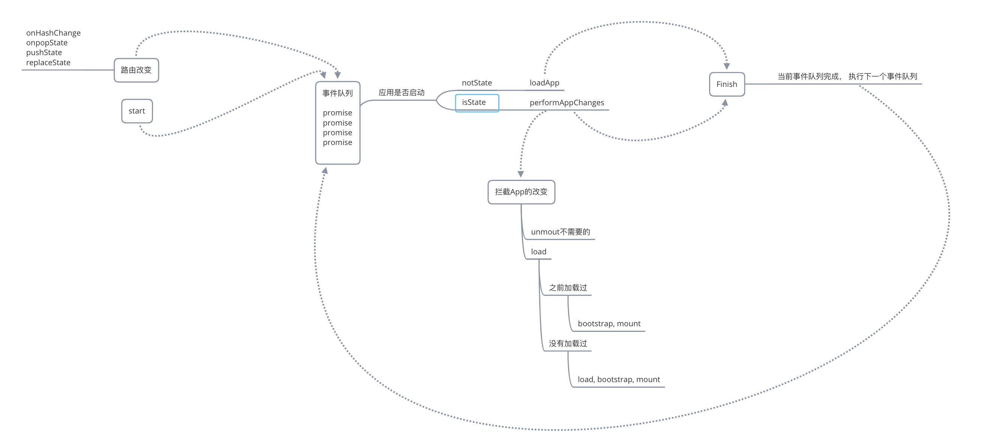
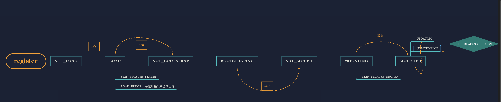

## SingleSpa源码分析


1. 简单介绍single-spa, 比如说它的特性, api, 使用方式等    5-10min

2. Single-spa实现微前端的思路和流程。 10-20min

   主要是分析一下single-spa中是如何管理每个app的状态的， 

   以及它加载， 卸载应用的机制等，

   还有就是整个框架的流程等。

3. 从singleSpa的api入口，看single-spa是如何实现的。10-20min

   结合代码分析，

   如何实现的一个页面多个框架的应用。

   兼容多个框架并且页面切换的时候无需刷新

   以及它的状态和生命周期管理等等。

4. 总结， 提问.  10min

附上我自己实现的一个精华版的single-spa， 里面包含了详细的注释和实现思路， 供大家鉴赏

### 1. Single-spa简介

single-spa是一个微前端应用的框架， 它主要有以下几个优势。

- 在同一页面上[使用多个框架](https://single-spa.js.org/docs/ecosystem#help-for-frameworks)[而无需刷新页面](https://single-spa.js.org/docs/building-applications) （[React](https://single-spa.js.org/docs/ecosystem-react)，[AngularJS](https://single-spa.js.org/docs/ecosystem-angularjs)，[Angular](https://single-spa.js.org/docs/ecosystem-angular)，[Ember](https://single-spa.js.org/docs/ecosystem-ember)或您使用的任何东西）
- 独立部署每个应用
- 使用新框架编写代码，而无需重写现有应用程序。 迁移成本低。
- 惰性加载方式， 优化首评渲染速度,  缓存、预加载等

接下来我们也会介绍这几个特性都如何实现的。

这里是single-spa的一些资料

1. 官网Api: https://single-spa.js.org/docs/api/
2. 相关例子: 
   - 主应用 https://github.com/vue-microfrontends/root-config/tree/master/src
   - 子应用 https://github.com/vue-microfrontends/rate-dogs
   - 示例 https://vue.microfrontends.app/rate-doggos


简单介绍一下api和使用方式。

single-spa主要暴漏出两个api

- registerApplication: 注册应用

  ```js
  import { registerApplication, start } from 'single-spa';
  
  singleSpa.registerApplication(
      'appName', // 应用名称
      () => System.import('appName'), // 加载函数 system， loadScript等
      location => location.pathname.startsWith('home'), // 匹配方式
      customProps: {}  // prop通信数据
  )
  
  ```

- start

  ```js
  singleSpa.start() // 启动应用
  ```

子项目接入的时候，需要提供三个生命周期，bootstrap, mount, unmount, 以及应用加载和卸载的方式， 这里注意， vue和react的方式不一样， 所以拆成了两个包。 后面会详细介绍

```js
const vueLifecycles = singleSpaVue({
  Vue,
  appOptions: {
    el: '#nav',
    router:routes,
    store,
    render: h => h(App)
  }
});

export const bootstrap = [
  vueLifecycles.bootstrap,
];

export const mount = [
  vueLifecycles.mount,
];

export const unmount = [
  vueLifecycles.unmount,
];

```

### single-spa主流程解析

首先， 要明确两个点：

第一, single-spa是通过事件循环来控制每个应用之间的状态切换的（invoke函数）

第二, single-spa是就像一个状态机，通过给应用设置各种状态， 来管理应用




接下来， 我们来看一下single-spa框架的主流程是

- 首先，将路由改变需要切换的app或者用户用户手动调起的app包装后， 统一push到事件队列里面

- 如果容器应用没有启动， 那么加载需要加载的app。加载成功之后调用finish方法， 清空当前的执行栈

- 如果容器已经启动，切换app的时候，卸载不需要的app，加载需要的app，挂载需要的app。 完成之后

  清空当前的执行栈。

- 如果过程中，有路由改变等事件， 需要切换app的时候， 将它放入到下一个执行栈中

  

### singleSpa中的状态机

我们先来熟悉一下single-spa中应用的各种状态




- 默认为NOT_LOAD
- LOAD:   开始加载应用
- NOTBOOTSTRAP:  加载成功未启动
- BOOTSTRAPING: 开始挂载/启动， 执行bootstrap生命周期， 只执行一次
- NOT_MOUNTED：BOOTSTRAP生命周期函数执行完成(成功)
- MOUNTING: 开始执行mount生命周期函数
- MOUNTED:  app挂载成功， mount生命周期函数执行成功， 可以执行Vue的$mount()或ReactDOM的render()
- UNMOUNTING: unmount生命周期函数执行，执行 Vue的$destory()或ReactDOM的unmountComponentAtNode()。
- SKIP_BECAUSE_BROKEN： 状态改变出错
- LOAD_ERROR： 一般是用户提供的信息有误，导致加载出错

```js
export const NOT_LOADED = 'NOT_LOADED';
export const SKIP_BECAUSE_BROKEN = 'SKIP_BECAUSE_BROKEN';
export const LOAD_ERROR = 'LOAD_ERROR'
export const LOAD_SOURCE_CODE = 'LOAD_SOURCE_CODE'
export const NOT_BOOTSTRAP = 'NOT_BOOTSTRAP'
export const BOOTSTRAPPING = 'BOOTSTRAPPING';
export const NOT_MOUNTED = 'NOT_MOUNTED';
export const MOUNTED = 'MOUNTED'
export const MOUNTING = 'MOUNTING';
export const UNMOUNTING = 'UNMOUNTING';
export const UPDATING = 'UPDATING';


// import { NOT_LOADED, notLoadError, notSkip, isntLoaded, shouldBeActivity } from './appsHelper';
export function notSkip(app) {
    return app.status !== SKIP_BECAUSE_BROKEN;
}

export function notLoadError(app) {
    return app.status !== LOAD_ERROR;
}

export function isntLoaded(app) {
    return app.status === NOT_LOADED;
}

export function isLoaded(app) {
    return app.status !== NOT_LOADED && app.status !== SKIP_BECAUSE_BROKEN && app.status !== LOAD_ERROR;
}

export function isActive(app) {
    return app.status === MOUNTED
}

export function isntActive(app) {
    return !isActive (app)
}

export function shouldBeActivity(app) {
    try {
        return app.activityWhen(window.location)
    }catch(e) {
        app.status = SKIP_BECAUSE_BROKEN
        console.log(e)
    }
}

export function shouldntBeActivity(app) {
    try {
        return !app.activityWhen(window.location);
    } catch(e) {
        app.status = SKIP_BECAUSE_BROKEN;
        throw e;
    }
}
```

app状态管理

- 需要加载的app

  ```js
  /**
   * @function 获取需要被加载的app
   * 当前app 的状态不是SKIP_BECAUSE_BROKEN, 不是LOAD_ERROR，是NOT_LOADED 同时是应该被加载
   */
  export function getAppsToLoad() {
      return APPS.filter(notSkip).filter(notLoadError).filter(isntLoaded).filter(shouldBeActivity)
  }
  
  
  /**
   * @function 获取需要被挂载的app
   * 当前app 的状态不是SKIP_BECAUSE_BROKEN, 已经加载过，没有被激活， 同时是应该挂载
   */
  export function getAppsTomount() {
      return APPS.filter(notSkip).filter(isLoaded).filter(isntActive).filter(shouldBeActivity)
  }
  
  // 获取需要被挂载的app
  export function getAppsToUnmount() {
      return APPS.filter(notSkip).filter(isActive).filter(shouldntBeActivity)
  }
  
  // 获取当前已经挂载的app
  export function getMountedApps() {
      return APPS.filter(app => {
          return isActive(app)
      })
  }
  ```

  

**超时处理**


### 代码复现整个流程

- 首次加载， 用户通过registerApplication注册应用, 这里是将所有注册的app收集起来，后面会通过各种状态筛选需要的app。 最后调用invoke函数

  ```js
  /**
   * @function 注册App
   * @param {string} appName 要注册的app的名称
   * @param {Function: Promise | Object} loadFunction app异步加载函数， 或者app的内容
   * @param {Function: boolean} activityWhen  判断该app应该何时启动
   * @param {Object} customProps  自定义参数配置
   * return Promise
   */
  const APPS = []
  export function registerApplication(appName, loadFunction, activityWhen, customProps = {}) {
      // 判断参数是否合法
      if(!appName || typeof appName !== 'string') {
          throw new Error('appName不可以是一个空字符串')
      }
      if(!loadFunction) {
          throw new Error('loadFunction must be a function or object')
      }
      if(typeof loadFunction !== 'function') {
          loadFunction = () => Promise.resolve(loadFunction)
      }
      if(typeof activityWhen !== 'function') {
          throw new Error('activityWhen must be a function')
      }
  
      APPS.push({
          name: appName,
          loadFunction,
          activityWhen,
          customProps,
          status: NOT_LOADED
      })
  
      invoke();
  }
  ```

- invoke函数主要就是控制应用的状态, 同时控制当前事件循环的队列。

  如果当前事件循环没有处理完成， 那么将需要被操作的app放入到下一次的事件循环中

  同时判断容器应用有没有被启动， 如果启动， 那么调用performAppChanges切换应用

  如果没有启动， 那么开始加载需要被加载的应用

  ```js
  // 默认没有进行事件循环
  let appChangesUnderway = false;
  let changesQueue = [];
  
  /**
   * @function 控制应用的状态，同时控制当前事件循环的队列
   * @param {*} pendings 当前事件队列
   * @param {*} eventArgs 路由切换的参数
   */
  export function invoke(pendings = [], eventArgs) {
      // 先检查appChanges有没有在做事件循环， 如果正在做事件循环， 将当前app放入到事件队列里面等待
      // 事件队列不存储app的信息， 所有的app都会放入到APPS的全局状态中，每次先获取
      if(appChangesUnderway) {
          return new Promise((resolve, reject) => {
              changesQueue.push({
                  success: resolve,
                  failure: reject,
                  eventArgs
              })
          })
      }
  
      // 表示当前正在进行事件循环
      appChangesUnderway = true
  
      // 这里是整个SingleSpa的状态， 判断容器应用是否启动
      if(isStarted()) {
          return performAppChanges()
      }
  
      // 获取需要被加载的app
      return loadApps();
  }
  ```

- performAppChanges， 切换应用状态

  ```js
      /**
       * @function 如果应用已经启动，那么卸载不需要的app，加载需要的app，挂载需要的app
       */
      function performAppChanges() {
          // 先卸载不需要的app， 这里是放到promise中， 开始执行
          let unmountPromise = getAppsToUnmount().map(toUnmountPromise);
          unmountPromise = Promise.all(unmountPromise);
  
          // will load app --> NOT_MOUNTED
          let loadApps = getAppsToLoad()
          loadApps = loadApps.map(app => {
              // 先去加载， 加载完成之后调用bootstrap, 然后卸载，然后加载
              return toLoadPromise(app).then((app) => {
                  return toBootstrapPromise(app)
                      .then(() => unmountPromise)
                      .then(() =>  toMountPromise(app))
              })
          });
  
          // will mount app --> NOT_MOUNTED
          let mountApps = getAppsTomount();
  
          // 针对load和mount的app做去重， 这里看一下， 为什么要去重
          mountApps = mountApps.filter(app => loadApps.indexOf(app) === -1) 
  
          mountApps = mountApps.map((app) => {
              return toBootstrapPromise(app)
                  .then(() => unmountPromise)
                  .then(() => toMountPromise(app))
          })
  
          // 卸载没有问题的时候， 进行挂载新的
          return unmountPromise.then(() => {
              let allPromises = loadApps.concat(mountApps);
              
              return Promise.all(allPromises.map(toMountPromise)).then(() => {
                  callAllCaptureEvents()
                  return finish();
              }, e => {
                  // 当一个promise状态已经改变的时候， 再次调用的时候不会在改变
                  pendings.forEach(item => item.failure(e));
                  throw e
              })
          }, e => {
              callAllCaptureEvents()
              console.log(e)
          })
      }
  ```

- 加载完应用或者切换应用完成的时候， 调用finish方法清空当前的事件队列， 开始调用下一次事件队列

  ```js
       function finish() {
          // 路由改变， 或者是调用start方法
          // /home, 正在加载appA的时候， route变为了/index
          // appA加载完成之后， 必须立马加载appB， 将appB放到changesQueue里面，
          let returnValue = getMountedApps();
  
          if(pendings.length) {
              pendings.forEach(item => item.success(returnValue))
          }
  
          // 当前的循环已经完成
          appChangesUnderway = false;
          if(changesQueue.length) {
              // backup就是当前循环中被推到事件队列里的事件， 这些事件交给下一次的invoke处理
              let backup = changesQueue;
              changesQueue = [];
  
              invoke(backup);
          }
          
          return returnValue
      }
  ```


singleSpa的主流程大概就是这样。接下来我们分析两个问题

1. singleSpa是如何实现不刷新就可以切换多框架的应用的。
2. singleSpa中都做了哪些优化


### singleSp中的路由管理

这里主要介绍一下singleSpa实现不刷新就可以切换多框架的应用的。

其实， vue或者react中的hash路由或者history路由，

都是基于浏览器的**hashchange**和**popstate**事件来做的(pushState, replaceState)， 

所以在singleSpa中， 对这几个事件进行了拦截。 当路由改变的时候， 

优先出发singleSpa的切换应用方法(invoke)， 

之后在执行Vue或者react等其他应用的路由方法

```js
import { invoke } from "./invoke";

const HIJACK_EVENTS_NAME = /^(hashchange|popstate)$/i;
const EVENT_POOL = {
    hashchange: [],
    popstate: []
}

function reroute() {
    invoke([], arguments)
}

window.addEventListener('hashchange', reroute);
window.addEventListener('popstate', reroute);

const originalAddEventListener = window.addEventListener;
const originalRemoveEventListener = window.removeEventListener;

window.addEventListener = function(eventName, handler, ) {
    if(eventName && HIJACK_EVENTS_NAME.test(this.eventName)) {
        EVENT_POOL[eventName].indexOf(handler) === -1 && EVENT_POOL[eventName].push(handler)
    }else {
        originalAddEventListener.apply(this, arguments)
    }
}

window.removeEventListener = function(eventName, handler, ) {
    if(eventName && HIJACK_EVENTS_NAME.test(this.eventName)) {
        let events = EVENT_POOL[eventName]
        events.indexOf(handler) > -1 && 
        (EVENT_POOL[eventName] = events.filter(fn => fn !== handler))
    }else {
        originalRemoveEventListener.apply(window , arguments)
    }
}

function mokePopStateEvent(state) {
    return new PopStateEvent('popstate', { state })
}

const originalPushState = window.history.pushState;
const originalReplaceState = window.history.replaceState;

window.history.pushState = function(state, title, url) {
    let result = originalPushState.apply(this, arguments);

    reroute(mokePopStateEvent(state));

    return result;
}

window.history.replaceState = function(state, title, url) {
    let result = originalReplaceState.apply(this, arguments);

    reroute(mokePopStateEvent(state));

    return result;
}

export function callCaptureEvents(eventsArgs) {
    if(!eventsArgs) {
        return
    }

    if(!Array.isArray(eventsArgs)) {
        eventsArgs = [eventsArgs]
    }

    let name = eventsArgs[0].history;

    if(!EVENT_POOL[name] || EVENT_POOL[name].length === 0) {
        return;
    }

    EVENT_POOL[name].forEach(handler => {
        handler.apply(null, eventsArgs)
    })
}
```


### Single-spa中还做了哪些优化

比如说应用超时处理等

singleSpa中对每个应用状态的切换都做了超时处理， 当应用切换超时的时候，可以自定义操作

```js

const TIMEOUTS = {
    bootstrap: {
        milliseconds: 3000,
        rejectWhenTimeout: false
    },
    mount: {
        milliseconds: 3000,
        rejectWhenTimeout: false
    },
    unmount: {
        milliseconds: 3000,
        rejectWhenTimeout: false
    }
}

export function reasonableTime(lifecyclePromise, description, timeout) {
    return new Promise((resolve, reject) => {
        let finished = false;
        lifecyclePromise.then((data) => {
            finished = true;
            resolve(data)
        }).catch(e => {
            finished = true;
            reject(e)
        })

        setTimeout(() => {
            if(finished) { return };
            if(timeout.rejectWhenTimeout) {
                reject(`${description}`)
            }else {
                console.log('timeout but waiting')
            }
    
        }, timeout.milliseconds)
    })
}

export function ensureTimeout(timeouts = {}) {
    return {
        ...TIMEOUTS,
        ...timeouts
    }
}
```

### 备注：

微前端中app分为两种：一种是根据Location进行变化的，称之为app。另一种是纯功能(Feature)级别的，称之为service。

vue和react切换的区别

Vue 2.x的dom挂载，采取的是 **覆盖Dom挂载** 的方式。例如，组件要挂载到`#app`上，那么它会用组件覆盖掉`#app`元素。

但是React/Angular不同，它们的挂载方式是在目标挂载元素的内部`添加元素`，而不是直接覆盖掉。 例如组件要挂载到`#app`上，那么他会在`#app`内部挂载组件，`#app`还存在。

这样就造成了一个问题，当我从 vue子项目 => react项目 => vue子项目时，就会找不到要挂载的dom元素，从而抛出错误。


分享预热：

Hello， 大家好， 今天给大家精心准备了一个关于微前端框架single-spa实现原理的分享～

想知道single-spa是如果在同一个页面实现支持多框架应用的嘛？

想知道它是如何实现的不刷新页面切换不同应用的嘛？

想知道它是如何管理多个应用以及他们之间的状态是如何流转的嘛？

想知道single-spa为了性能都做了哪些优化吗 ？  

比如它是如何惰性加载应用， 以及缓存应用的

以及如何实现开发和生产环境一键式部署的呢？

今天下午5点整会跟大家一起从0开始探索single-spa微前端框架的实现原理

欢迎一起来讨论学习。

分享流程如下

1. 简单介绍single-spa的api以及使用方式    5-10min

2. Single-spa实现微前端的思路和流程。 10-20min

   主要是分析一下single-spa中是如何管理每个app的状态的， 

   以及它加载， 卸载应用的机制等，

   还有就是整个框架的流程等。

3. 从singleSpa的api入口，看single-spa是如何实现的。10-20min

   结合代码分析，

   如何实现的一个页面多个框架的应用。

   兼容多个框架并且页面切换的时候无需刷新

   以及它的状态和生命周期管理等等。

4. 总结， 提问.  10min

5. 下个分享预告。 5分钟

附上我自己实现的一个精华版的single-spa， 里面包含了详细的注释和实现思路， 供大家鉴赏

